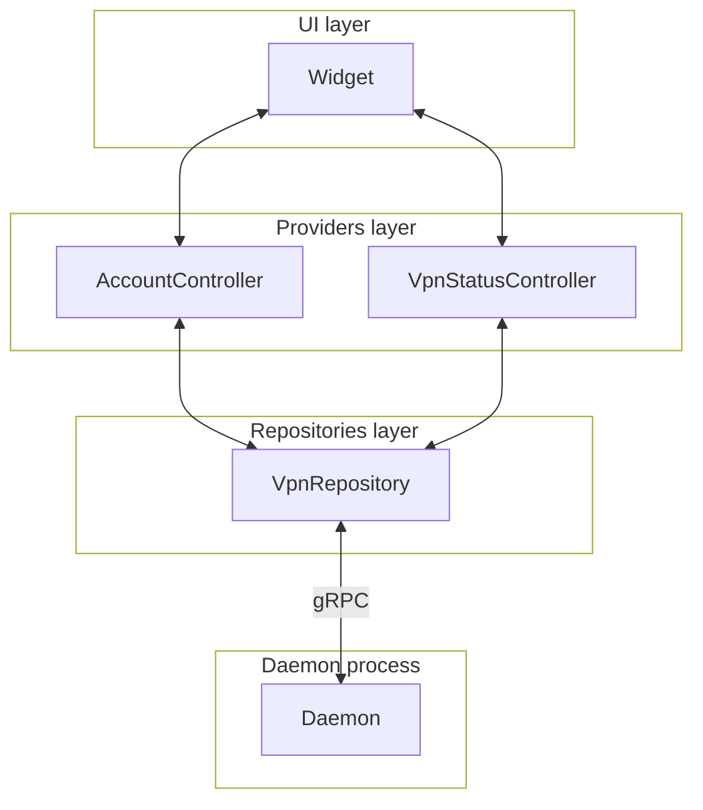

# Contributing

## Table of contents

- [Building and testing](#building-and-testing)
- [Architecture](#architecture)
- [PR Workflow](#pr-workflow)
  - [Build and Test](#build-and-test)
  - [PR Hygiene](#pr-hygiene)
- [Licensing](#licensing)
- [Contributor License Agreement](#contributor-license-agreement)
- [Code of conduct](#code-of-conduct)

We happily accept both issues and pull requests for bug reports, bug fixes,
feature requests, features implementations and documentation improvements.
For new features we recommend that you create an issue first so the feature can
be discussed and to prevent unnecessary work in case it's not a feature we want
to support. Although, we do realize that sometimes code needs to be in place to
allow for a meaningful discussion so creating an issue upfront is not a requirement.

## Building and testing

You can find everything related to building, testing and environment setup in [BUILD.md](./BUILD.md).
The application utilizes the Riverpod annotations and
[generator](https://pub.dev/packages/riverpod_generator) for its repositories and
providers. Consequently, whenever modifications are made to these classes, the
command `dart run build_runner build` must be executed. Alternatively,
`dart run build_runner watch` can run in the background, allowing automatic
regeneration of files upon detection of changes.

## Architecture

The application uses [Riverpod](https://riverpod.dev/) for managing its state.
The application is split in 3 layer: UI/widgets, providers/controller and repositories.

### Repositories

They serve the purpose of communicating with the daemon process through gRPC,
responsible for retrieving and transmitting data to the daemon.

### Providers

Providers or controllers act as an intermediary layer, facilitating communication
between repositories and widgets. They play a crucial role in managing state and
dependencies within a Flutter application. Widgets, in turn, observe these
providers for changes and dynamically update the user interface accordingly.

### Widgets

Widgets represent the visual elements displayed on the user interface. They
interact with providers to either retrieve or transmit data to repositories.

## PR Workflow

We want to get your changes merged as fast as possible, and we know you want
that too. To help with this there are a few things you can do to speed up the process:

### Build and Test

Make sure your changes can be built locally and `flutter analyze` doesn't return
any new errors.

### PR Hygiene

Every PR will go through code review, and you can help us speed up the review
process by making your PR easier to review.
Here are some guidelines:

**Small PRs are easier to review than big PRs:** Try to keep your PRs small and
focused. To achieve that, try to make sure you PR doesn't contain multiple
unrelated changes and if you are doing some bigger feature work, try to split
the work into multiple smaller PRs that solve the problem together.

**A clean history can make things easier:** Some PRs are easier to review
commit-by-commit, rather than looking at the full changelist in one go. To enable
that, prefer rebase over merge when updating your branch. Keeping PRs small and
short-lived will also help keep your history clean since there's less time for
upstream to change that.

## Licensing

NordVPN Linux® GUI is released under GPL-3.0 License. For more details please
refer to [LICENSE.md](../LICENSE.md) file.

## Contributor License Agreement

To accept your pull request, we need you to agree with the Nord Security
Contributor License Agreement (CLA). The CLA signing is integrated into the PR
workflow, you only need to authenticate with your GitHub account to validate
your identity. Additionally the CLA needs to be agreed just once.
In any case please let us know if you need additional support and guidance.

## Code of conduct

Nord Security and all of it's projects adhere to the
[Contributor Covenant Code of Conduct](https://github.com/NordSecurity/.github/blob/master/CODE_OF_CONDUCT.md).
When participating, you are expected to honor this code.

**Thank you!**
